<h1 align="center">PramaanAI</h1>

<p align="center">
  <strong>AI-Based Fake Identity & Document Screening System</strong><br>
  Smart India Hackathon 2026 | Problem Statement ID: 26188<br>
  Ministry of Home Affairs / Sashastra Seema Bal (SSB) — Police II Division
</p>

<p align="center">
  <a href="https://pramaanai-703j.onrender.com">Live Website</a> &bull;
  <a href="https://github.com/BhartiKumarii/PramaanAI/releases/tag/v1.0.0">Download APK</a> &bull;
  <a href="#screenshots">Screenshots</a>
</p>

---

## Quick Start — Try It Now

> **Demo Credentials (works on both website and Android app)**
>
> | Role | Username | Password |
> |------|----------|----------|
> | IT Admin (full access) | `officer1` | `BorderShield123` |
> | Field Officer | `attari_officer` | `BorderShield123` |
>
> **Live Dashboard:** [pramaanai-703j.onrender.com](https://pramaanai-703j.onrender.com)
> **API Docs:** [bordershield-pramaan-api.onrender.com/docs](https://bordershield-pramaan-api.onrender.com/docs)
> **Android APK:** [Download from Releases](https://github.com/BhartiKumarii/PramaanAI/releases/tag/v1.0.0)
>
> *Note: Render free tier spins down after inactivity — first load may take 30-60 seconds.*

### Judge's Quick Start

1. **Web Dashboard** — Open [pramaanai-703j.onrender.com](https://pramaanai-703j.onrender.com), log in with `officer1` / `BorderShield123`. Explore cases, alerts, identity network, and audit logs.

2. **Android App** — Download the [APK](https://github.com/BhartiKumarii/PramaanAI/releases/tag/v1.0.0), install on an Android device (8.0+), log in with `attari_officer` / `BorderShield123`. Scan a document to see on-device OCR, MRZ validation, and verification evidence.

3. **API** — Visit [bordershield-pramaan-api.onrender.com/docs](https://bordershield-pramaan-api.onrender.com/docs) for the full Swagger UI. Authenticate via `POST /auth/login`.

| Resource | Link |
|----------|------|
| Live Website | [pramaanai-703j.onrender.com](https://pramaanai-703j.onrender.com) |
| GitHub Repository | [github.com/BhartiKumarii/PramaanAI](https://github.com/BhartiKumarii/PramaanAI) |
| Demo APK | [Download from Releases](https://github.com/BhartiKumarii/PramaanAI/releases/tag/v1.0.0) |
| Prototype Video | [ADD VIDEO LINK] |
| Project Report | [Documentation/PramaanAI-Report.pdf](Documentation/PramaanAI-Report.pdf) |
| Presentation | [Documentation/PramaanAI-Presentation.pdf](Documentation/PramaanAI-Presentation.pdf) |
| API Documentation | [bordershield-pramaan-api.onrender.com/docs](https://bordershield-pramaan-api.onrender.com/docs) |

---

## Project Overview

PramaanAI is an AI-powered document verification and identity screening system designed for SSB officers patrolling India's open land borders with Nepal (1,751 km) and Bhutan (699 km). These borders operate under treaty-based free movement — most crossers carry no passport. The real fraud risk is concentrated in impersonation and document tampering, not universal scanning.

PramaanAI assists officers in the field with on-device intelligence: real-time OCR, MRZ validation, document tampering analysis, face verification, and server-backed registry checks — all accessible from a single Android app that works online, on weak connections, or completely offline.

**This is a hackathon prototype.** All registry data is synthetic/mock. No real government database is accessed. The system assists officer decisions — it never declares guilt, denies entry, or asserts criminality.

---

## Problem Statement

**PS ID:** 26188  
**Organization:** Ministry of Home Affairs / Sashastra Seema Bal (SSB)  
**Category:** Software  
**Theme:** Miscellaneous

SSB guards India's two open, treaty-based land borders via Border Out Posts and mobile patrols, not fixed immigration desks. Officers need a portable, intelligent tool that can verify identity documents in the field — even without reliable internet connectivity — and flag potential fraud for human review.

---

## Proposed Solution

A three-component system:

1. **Android App** — Field tool for SSB officers. Captures documents, runs on-device verification (OCR, MRZ, tampering detection, face matching), caches results offline, syncs when connectivity returns.

2. **FastAPI Backend** — Central verification server. Runs registry lookups, risk scoring, identity graph analysis, and returns explainable results. All data is encrypted in transit; raw images never leave the device.

3. **Web Dashboard** — Combined operational console for case management, alerts, identity network visualization, audit logs, analytics, and system administration.

---

## Key Features

### On-Device Intelligence (Android)
- **Dual-script OCR** — Latin + Devanagari recognition via ML Kit (fully on-device, no network)
- **MRZ Parsing & Validation** — ICAO 9303 TD3 passport/visa MRZ with 5-field check-digit verification
- **Document Type Detection** — Scoring system with 40+ signals across 8 document categories
- **Country Detection** — Automatic India/Nepal/Bhutan identification from document patterns
- **Document Mismatch Warning** — Detects when the scanned document doesn't match the selected type
- **QR/Barcode Scanning** — Decodes Aadhaar QR, PDF417, and other machine-readable codes; cross-checks decoded data against OCR
- **Face Detection** — ML Kit face detection on both document photo and live selfie
- **Face Embedding & Matching** — MobileFaceNet neural embeddings with HOG fallback
- **Tampering Analysis** — Error Level Analysis (ELA) for detecting edited regions
- **Deepfake/Anti-spoof Detection** — On-device analysis of selfie authenticity
- **Image Quality Gate** — Blur, glare, lighting, and shadow detection with officer guidance
- **Perspective Correction** — Automatic document edge detection and crop
- **Verification Evidence** — Per-check PASS/WARNING/FAIL/NOT_AVAILABLE display with reasons
- **Offline Operation** — Full local extraction + encrypted queue with automatic sync via WorkManager
- **7 Languages** — Full UI localization: English, Hindi, Nepali, Bengali, Assamese, Punjabi, Dzongkha (434 strings each)

### Document Support
| Country | Documents |
|---------|-----------|
| India | Aadhaar (with Verhoeff checksum), PAN Card, Passport, Driving Licence, Voter ID (EPIC), Inner Line Permit |
| Nepal | Passport (MRZ), Citizenship Certificate, Driving Licence, Tourist Visa, Visa on Arrival |
| Bhutan | Passport (MRZ), Citizen Identity Card (CID), Driving Licence (RSTA), Visa |

### Server-Side Verification
- **Registry Lookup** — Exact (document number) and fuzzy (name) matching against mock registry
- **Risk Scoring** — Weighted fusion of checksum, forensics, deepfake, blacklist, face match, and identity signals
- **Identity Graph** — NetworkX connected-component analysis for multi-identity cluster detection
- **Cross-field Validation** — MRZ vs. printed fields, front vs. back consistency
- **HMAC-signed Records** — Every verification result is cryptographically signed; tampering is detected on read
- **Full Audit Trail** — Every action (screen, clear, dispute, decision) is logged with officer ID and timestamp
- **Blockchain Ledger** — Local mock hash-chained ledger with integrity verification

### Web Dashboard
- **Case Management** — Submit, review, decide (Clear / Secondary Review / Hold-Refer)
- **Real-time Alerts** — Document review required, risk assessment, duplicates, incomplete records
- **Identity Network** — Visual graph of identity clusters and relationships
- **Person Search** — Search across all screened individuals
- **Document Intelligence** — Document type analytics, country distribution, classification insights
- **Checkpoint Management** — Border checkpoint monitoring and status
- **Registry Management** — View and manage mock central registry entries
- **Audit Logs** — Complete audit trail with filtering
- **Analytics & Reports** — Risk trends, screening volume, officer activity
- **RBAC** — Server-enforced role-based access (IT Admin / Supervisor / Immigration Officer)

---

## System Architecture

```
+------------------+        +-------------------+       +------------------+
|   Android App    |  TLS   |   FastAPI Backend  |       |  Web Dashboard   |
| (Officer Field)  |------->|  (Central Server)  |<------| (Operational)    |
|                  |        |                    |       |                  |
| - ML Kit OCR     |  Only  | - Tesseract OCR    |       | - React + TS     |
| - MRZ Parser     | encoded| - ICAO Validation  |       | - Case Mgmt      |
| - Face Detection | data   | - ELA Forensics    |       | - Identity Graph |
| - ELA Tampering  | sent   | - Face Embedding   |       | - Alerts         |
| - QR Scanner     |  -->   | - Registry Lookup  |       | - Audit Logs     |
| - Offline Queue  |        | - Risk Engine      |       | - Analytics      |
| - WorkManager    |        | - Identity Graph   |       | - RBAC           |
+------------------+        | - Blockchain       |       +------------------+
                             | - PostgreSQL       |
                             +-------------------+
```

**Privacy by design:** Raw document and selfie images never leave the Android device for verification requests. Only extracted OCR fields, MRZ text, and face embedding vectors are transmitted, encrypted in transit.

---

## End-to-End Workflow

| Stage | Process | Output |
|-------|---------|--------|
| 1. Capture | Document front, back (optional), and live selfie | Raw images |
| 2. On-device processing | OCR, MRZ parsing, quality checks, face detection, tampering analysis | Structured fields + evidence |
| 3. Local cache check | Check for previously verified record | Cache hit / miss |
| 4. Connectivity check | Live health check — online, weak, or offline | Routing decision |
| 5a. Online | Send region crops + on-device text securely (never the full frame for verification); the document image and live face are then attached to the case as evidence | Verification request + case |
| 5b. Offline | Encrypt and queue case locally | Pending case |
| 6. Server verification | Registry match, identity graph, face comparison, risk scoring | Structured result |
| 7. Explainable result | Verified / Review Required / Flagged with reasons | Officer evidence |
| 8. Officer decision | Clear, or Send to admin with an auto-written, editable reason; the admin answers from the web console | Case decision |
| 9. Synchronization | Pending cases sync when connectivity returns | Centralized record |

The system assists decisions — it never blocks entry, declares guilt, or overrides the officer.

---

## Web Dashboard

The dashboard provides a unified operational view:

- **Landing Page** — Professional public-facing page explaining PramaanAI
- **Dashboard Home** — Real-time statistics, risk distribution, recent activity
- **Cases** — Full case lifecycle: pending, submitted, cleared, disputed
- **Alerts** — Prioritized notifications requiring attention
- **Identity Network** — Visual cluster graph of related identities
- **Document Intelligence** — Classification analytics and document type distribution
- **Checkpoints** — Border post status and monitoring
- **Registry** — Mock central registry with search
- **Audit Logs** — Complete action history with filtering
- **Reports** — Analytics and trend visualization

---

## Technology Stack

| Layer | Technologies |
|-------|-------------|
| **Backend** | Python, FastAPI, Pydantic, SQLAlchemy, PostgreSQL, Alembic, JWT/Argon2, Tesseract OCR, Pillow (ELA), NetworkX |
| **Android** | Kotlin, Jetpack Compose, CameraX, ML Kit (Text Recognition, Face Detection, Barcode Scanning), TensorFlow Lite (MobileFaceNet), Retrofit, WorkManager, Material 3 |
| **Frontend** | React 19, TypeScript, Vite, Tailwind CSS, Axios, Recharts |
| **Infrastructure** | Docker Compose, Render (backend + DB), GitHub Releases (APK) |

---

## Security & Privacy

- Raw document/selfie images **never leave the device** for verification — only extracted, encoded data is transmitted
- All network communication over TLS
- JWT authentication with Argon2 password hashing
- Server-enforced RBAC (IT Admin / Supervisor / Immigration Officer)
- HMAC-signed verification records — tampering detected on read
- On-device encryption for offline queue (Android Keystore)
- PII redaction filter on server logs
- No real government database access — all registry data is explicitly synthetic/mock
- No facial emotion, skin temperature, nationality, religion, or ethnicity used as risk signals

---

## Supported Documents & Test Cases

The `ID_DOCUMENT_DATASET/` directory contains sample documents for testing:

| Country | Document Types | Test Images |
|---------|---------------|-------------|
| India | Aadhaar, PAN, Passport, Driving Licence, Voter ID, ILP | 15+ samples |
| Nepal | Passport, Citizenship Certificate, Driving Licence, Visa | 20+ samples |
| Bhutan | Passport, CID, Driving Licence, Visa | 7+ samples |

### Verification Checks Performed

| Check | Status Values | Description |
|-------|--------------|-------------|
| Image quality | PASS / WARNING | Blur, glare, lighting, shadow detection |
| Document type detection | PASS / WARNING | Pattern-based classification (40+ signals) |
| Document type mismatch | WARNING | Selected vs. detected type comparison |
| Critical field extraction | PASS / WARNING | Name, DOB extraction completeness |
| Document number extraction | PASS / WARNING | ID/passport/DL number detection |
| MRZ check digits (5 fields) | PASS / FAIL | ICAO 9303 checksum validation |
| MRZ vs. printed consistency | PASS / WARNING | Cross-field comparison |
| Document expiry | PASS / WARNING / FAIL | Date validity check |
| QR/barcode scan | PASS / NOT_AVAILABLE | Code detection and cross-check |
| Face detection (selfie) | PASS / FAIL / WARNING | Single face verification |
| Face on document | PASS / WARNING | Photo presence on document |
| Document integrity check | PASS / WARNING / FAIL | Alteration detection |
| Photo authenticity check | PASS / WARNING / FAIL | Selfie genuineness check |
| Registry verification | PASS / FAIL / NOT_AVAILABLE | Registry lookup and risk scoring |

---

## Screenshots

### Web Dashboard

| Landing Page | Dashboard | Cases |
|:---:|:---:|:---:|
| 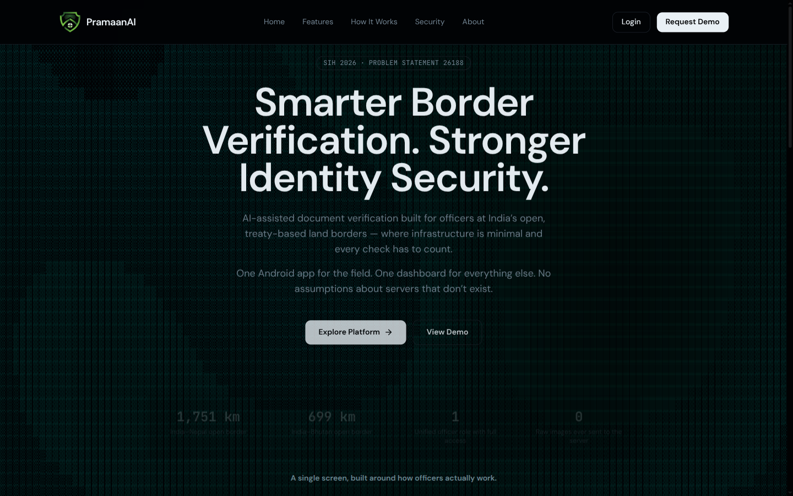 | 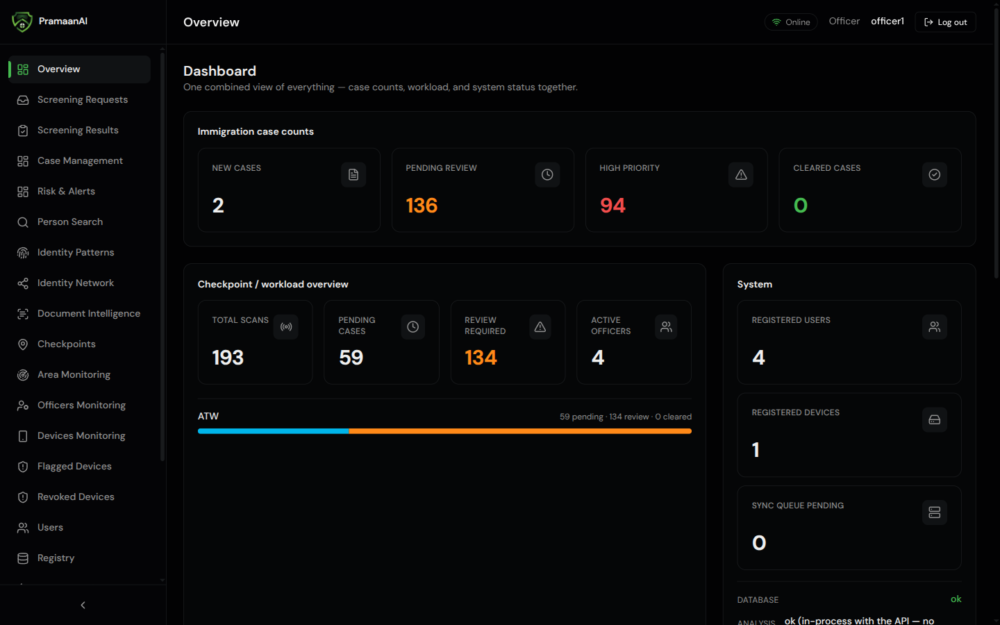 | 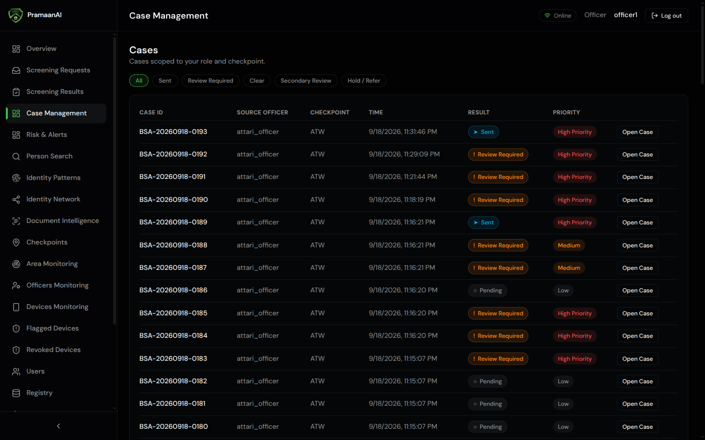 |

| Alerts | Person Search | Identity Network |
|:---:|:---:|:---:|
| 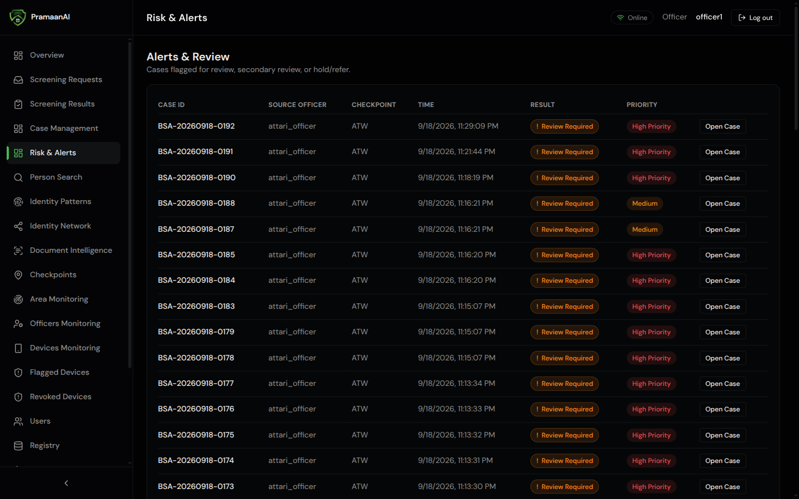 | 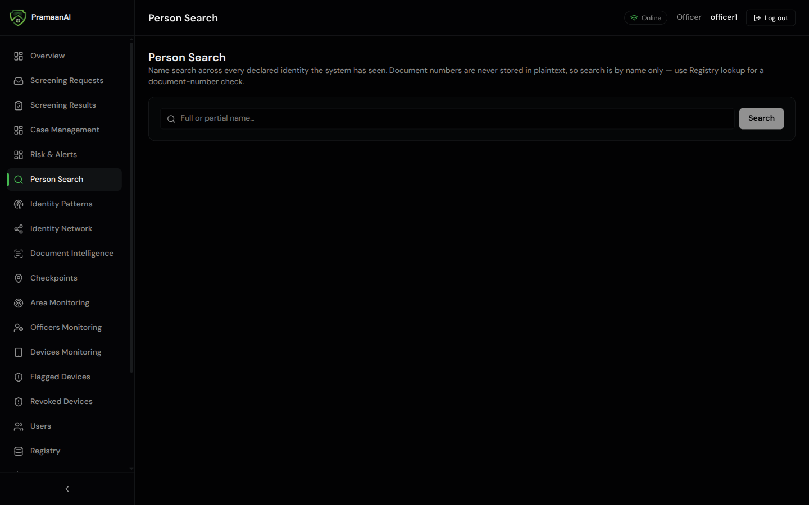 | 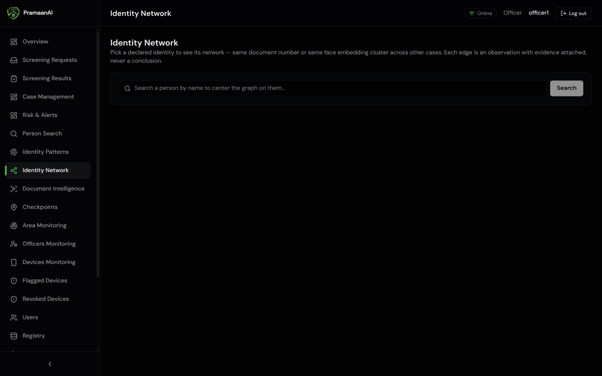 |

| Document Intelligence | Checkpoints | Registry |
|:---:|:---:|:---:|
| 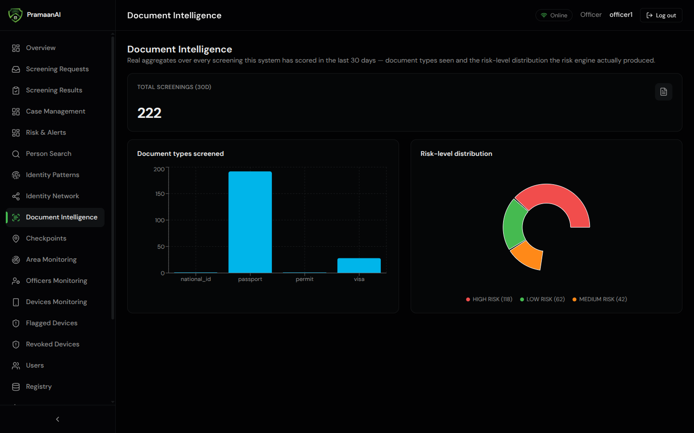 | 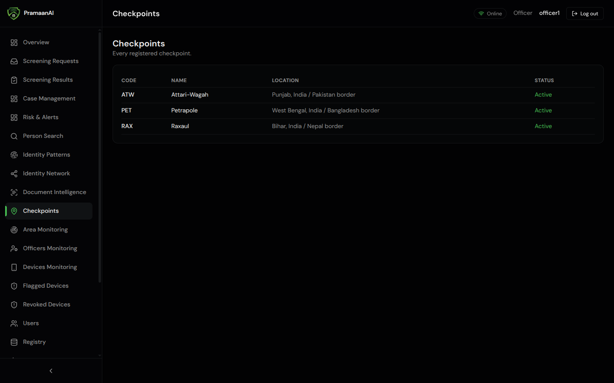 | 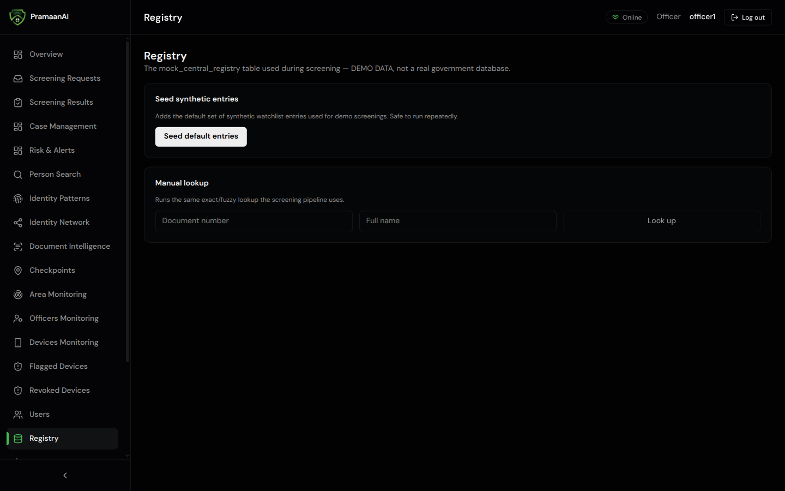 |

| Audit Logs | Reports | Case Detail |
|:---:|:---:|:---:|
| 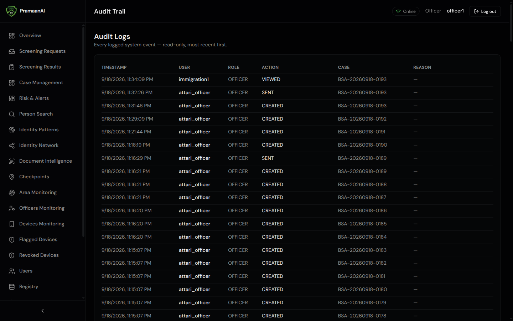 | 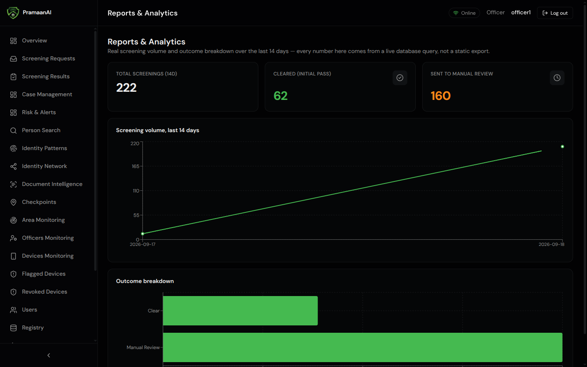 | 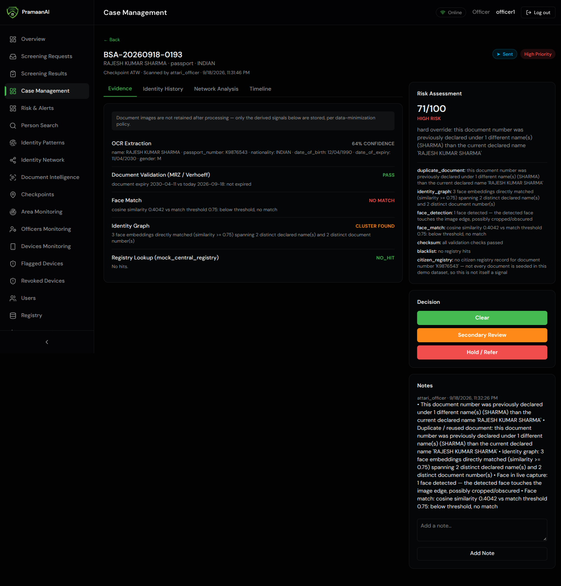 |

### Mobile App

*Add screenshots of the Android app to `Screenshots/Mobile/` — document capture, field review, verification evidence, screening result.*

---

## Limitations

- **Mock Data Only** — Registry lookups use synthetic data. No real government database is connected.
- **Deepfake Detection** — On-device heuristic; not a production-grade deep learning classifier.
- **Face Matching** — MobileFaceNet (128-d) with HOG fallback; less accurate than production face recognition systems.
- **ELA Forensics** — Single-pass Error Level Analysis has known false positives on text-dense documents.
- **Offline Mode** — Full local extraction works, but risk scoring and registry lookup require server connectivity.
- **Render Free Tier** — Backend and database on Render's free tier may experience cold-start delays and resource limits.

---

## Future Scope

- Integration with real government databases (UIDAI, Passport Seva, immigration systems) via approved APIs
- Production-grade deep learning models for face recognition and deepfake detection
- Multi-frame liveness detection with challenge-response
- Edge deployment for Border Out Posts with limited connectivity
- Multi-language UI expanded (currently English, Hindi, Nepali, Bengali, Assamese, Punjabi, Dzongkha — all 434 strings)
- Biometric integration (fingerprint, iris) where hardware is available
- Real-time inter-checkpoint communication network
- Progressive Web App for the dashboard

---

## Team AlphaX

[ADD TEAM MEMBER DETAILS]

---

## Running Locally

### Backend

```bash
# Docker (recommended)
docker compose up --build
docker compose exec app alembic upgrade head
docker compose exec app python -m scripts.seed_admin officer1 'Str0ngPass!'

# Without Docker
python -m venv .venv && source .venv/bin/activate
pip install -r requirements-dev.txt
alembic upgrade head
uvicorn app.main:app --reload
```

### Frontend

```bash
cd frontend
npm install
npm run dev
```

### Android

Open `android/` in Android Studio. Build and run on a device with camera access.

---

## License

This project is a hackathon prototype developed for Smart India Hackathon 2026. 

---

<p align="center">
  <strong>PramaanAI</strong> — Empowering SSB officers with intelligent document verification at India's borders.
</p>

## Modular document verification (`/api/v1`)

Evidence-based verification of passports, visas, permits, driving licences,
Aadhaar-type cards and immigration stamps for the India–Nepal and
India–Bhutan borders. The Android app runs a small on-device YOLO11n model
to locate regions and sends only those crops, in one HTTPS request; OCR,
MRZ, QR/barcode, stamps, face, forensics, registry comparison and the final
decision run on the server. Results are PASS / REVIEW_REQUIRED / NOT_VERIFIED
/ … with named reasons and evidence boxes — never "fake" or "real".

* Architecture, API, data formats, scaling: [`Documentation/DOCUMENT_VERIFICATION.md`](Documentation/DOCUMENT_VERIFICATION.md)
* Checklist and test-condition coverage: [`Documentation/TEST_CONDITIONS.md`](Documentation/TEST_CONDITIONS.md)
* Latest evaluation: `reports/docverify_evaluation.md`, `reports/yolo_region_detector.json`
